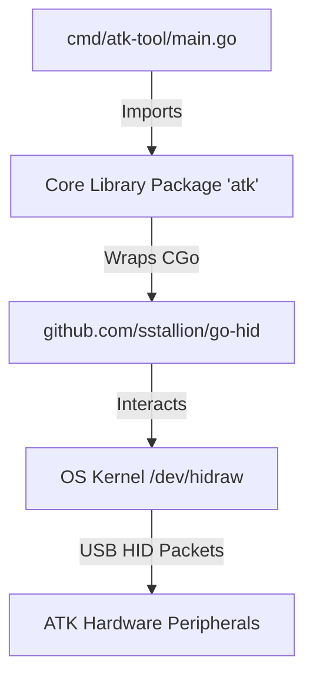

# Design Architecture: ATK Peripheral Tool

This document outlines the software design, package architecture, and core design principles of the `atk-tool` codebase.

---

## 🏛️ System Architecture

The project is structured into two main components:
1. **Core Library (`atk` package)**: An API wrapper around the low-level HID communication. It handles device enumeration, registry matching, connection lifecycle, and packet input/output.
2. **Command-Line Interface (`atk-tool` binary)**: A Cobra-powered CLI tool providing human-readable and JSON formatted output.

---

## 📂 Design Components

### 1. HID Initialization Lifecycle
The underlying dependency `go-hid` binds to the C `hidapi` library. To prevent memory leaks and unreleased device handles:
- The library does not auto-initialize. It exposes [Init()](file:///home/mechsoull/Projects/atk-tool/atk.go#L7) and [Exit()](file:///home/mechsoull/Projects/atk-tool/atk.go#L13) wrappers.
- The CLI enforces this lifecycle globally using Cobra's `PersistentPreRunE` and `PersistentPostRun` hooks in [main.go](file:///home/mechsoull/Projects/atk-tool/cmd/atk-tool/main.go).

### 2. Device Registry & Runtime Expansion
Support for devices is defined as data-driven specifications rather than hardcoded logic.
- **Definition Structure**: A [DeviceDefinition](file:///home/mechsoull/Projects/atk-tool/registry.go#L4) specifies a device's identifying Vendor ID, Product ID, raw Usage Pages, and its communications Report ID.
- **Matching & Filtering**: The USB subsystem may expose multiple HID nodes (e.g. keyboard endpoints, mouse endpoints, manufacturer-specific endpoints) for a single physical device. The matching logic ensures we only open interfaces matching target `UsagePages` (typically `0xFF02` or `0xFF04` for raw vendor transfers).
- **Extensibility**: Consuming programs can call [RegisterDevice()](file:///home/mechsoull/Projects/atk-tool/registry.go#L62) at runtime to append custom models without modifying the core library code.

### 3. Enumeration & Deduplication
The [Enumerate()](file:///home/mechsoull/Projects/atk-tool/discovery.go#L10) function scans the host system:
- It iterates through registered device definitions and queries the OS.
- Because USB devices can expose multiple virtual interface paths for the same hardware device, the scanning logic tracks `seenPaths` to ensure each unique physical/logical interface path is returned exactly once.

### 4. CLI Fallback Query Logic
When retrieving battery/voltage status without a target path:
- The CLI lists all matching ATK devices.
- It iterates through candidates, attempting to [Open()](file:///home/mechsoull/Projects/atk-tool/discovery.go#L50) and [QueryBattery()](file:///home/mechsoull/Projects/atk-tool/device.go#L50).
- If one candidate fails (e.g., disconnected or busy), it gracefully logs the error internally, closes the handle, and proceeds to the next candidate to find an active connection.

---

## 🔒 Error Handling Principles
- **No panics inside the library**: Functions return errors to callers using idiomatic Go multi-value returns.
- **Wrapped errors**: Low-level HID API errors are wrapped with context strings using `%w` to assist in debugging transport and hardware faults.
- **Graceful CLI exits**: Commands output errors to `stderr` or structured JSON messages depending on flags, and exit with status `1`.
